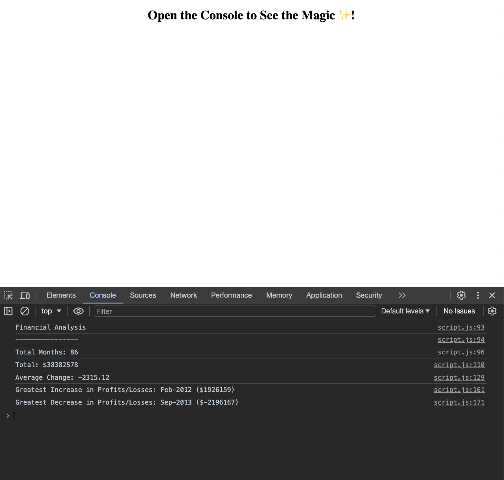

# Rupesh-Console-Finances

This repo contains JavaScript code that analyse the financial records of a company, which will be handy in real-world situation.

## Description

This project is a JavaScript project designed to analyze the financial records of a company. The provided financial dataset, composed of arrays with two fields (Date and Profit/Losses), serves as the basis for deriving key financial metrics. The primary goals include:

Total Number of Months:

- Calculate and display the total number of months included in the dataset.
  Net Total Amount of Profit/Losses:
- Compute and print the net total amount of Profit/Losses over the entire period.
  Average Changes in Profit/Losses:
- Track the total change in Profit/Losses from month to month and calculate the average.
- Formula: Total Change / (Number of Months - 1)
  Greatest Increase in Profit/Losses:
- Identify and display the date and amount of the greatest increase in Profit/Losses over the entire period.
  Greatest Decrease in Profit/Losses:
- Identify and display the date and amount of the greatest decrease in Profit/Losses over the entire period.

- The movtivation behind this project to apply JavaScript skills in a real-world scenario and perform financial analysis.
- It was build to gain hands-on experience in processing datasets, calculating financial metrics, and enhancing problem-solving skills.
- It provides insights into the financial performance of a company over a period, aiding decision-making.
- I have learned JavaScript language and implemented it to the real-world situation.

## Installation

N/A

## Usage

To execute the script and analyze the financial date:

- Open the index.html in your browser and right click in your mouse, to the inspect or inspect element click it into it.
- Once it open look for the console and open it and you will see the financial analysis.

Provide instructions and examples for use. Include screenshots as needed.

- https://rrana5106.github.io/Rupesh-Console-Finances/

## Credits

N/A

## License

N/A
